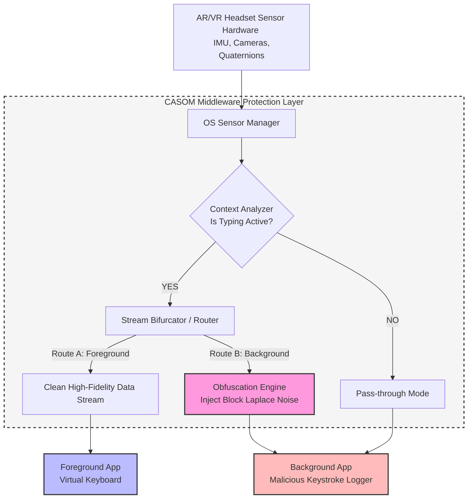
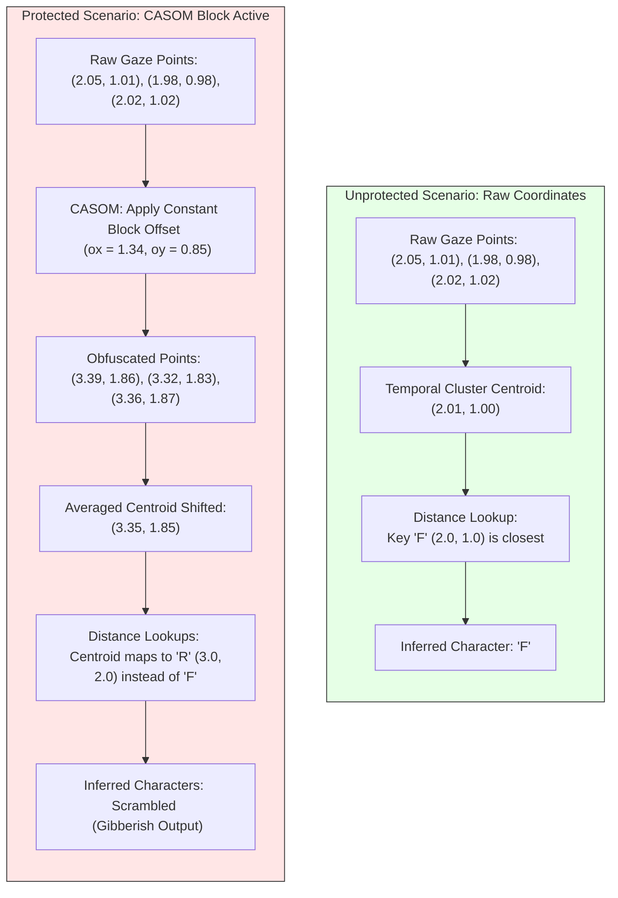

# CASOM: How the Protection Works (v2)

This document describes the operational flow and mechanism of the **Context-Aware Sensor Obfuscation Middleware (CASOM)**, illustrating how it defends against side-channel virtual keystroke attacks like SNOOPFINGER.

---

## 1. Operational Flow & Architecture

The protection operates as an OS-level middleware service in the AR/VR system. Below is the technical architecture showing the data routing and the security boundary:



---

## 2. Phase 1: Context-Aware Detection

> [!NOTE]
> Obfuscating sensor data continuously would degrade user experience (UX) for regular activities such as playing games, painting, or using VR gestures that require millimeter-level precision.
>
> To avoid this, CASOM is **context-aware** and only activates its obfuscation routine when typing is active.

- It monitors system focus events (e.g., when the Virtual Keyboard focus goes high).
- It analyzes head motion stability. Typing requires focusing on keys, which creates a signature pattern of micro-pauses.
- Once these triggers are detected, the middleware activates its **obfuscation routine**.

---

## 3. Phase 2: Stream Bifurcation (Data Separation)

Once typing is detected, CASOM separates the sensor streams between apps based on their permissions and window focus state:

1. **Foreground Application (Virtual Keyboard)**:
   - Receives the **raw, clean, high-precision** sensor coordinate data.
   - **Result**: Legitimate typing actions are processed with 100% accuracy and zero latency.
   
2. **Background Applications (Potential Spyware)**:
   - Blocked from reading raw sensor registers.
   - Forced to receive the output of the **obfuscation engine**.
   - **Result**: Malicious background trackers cannot access the high-resolution movements required to map gaze to keys.

---

## 4. Phase 3: Obfuscation Engine (Block Laplace Noise)

The SNOOPFINGER attack relies on **spatial-temporal clustering**. When a user types, their head pauses on key locations, creating dense clusters of gaze points. The attacker uses distance-based clustering algorithms to calculate the centroids of these clusters and matches them to standard keyboard coordinates.

CASOM v2 destroys this threat mathematically by applying **Block Laplace Noise** to the background data stream. Rather than perturbing each frame independently (which can be bypassed by averaging), the middleware shifts each dwell block by a single constant offset drawn from the Laplace distribution:

$$x' = x + \text{Noise}_x$$
$$y' = y + \text{Noise}_y$$

By setting the noise scale parameter to $1.5$ cm (which is larger than the width of a virtual key) and maintaining this offset over blocks of 15 frames, the points are scattered across multiple key boundaries, scrambling key centroids and breaking the relative geometry vectors.

---

## 5. Python Implementation Reference

In our codebase, this logic is implemented in [casom_defense.py](file:///d:/CS%20IEEE/CSIEEE/casom_defense.py):

```python
def obfuscate(self, gaze_points, segments=None):
    if self.mode == "iid":
        return self._iid(gaze_points)
    if self.mode == "correlated":
        return self._correlated(gaze_points)
    if self.mode == "per_keypress":
        return self._per_keypress(gaze_points, segments)
    if self.mode == "block":
        return self._block(gaze_points)
    if self.mode == "downsample":
        return self._downsample(gaze_points)
    raise ValueError(f"unknown mode: {self.mode}")

def _block(self, pts):
    out = []
    ox = oy = 0.0
    for i, (x, y) in enumerate(pts):
        if i % self.block_samples == 0:
            ox = self._laplace(self.noise_scale)
            oy = self._laplace(self.noise_scale)
        out.append((x + ox, y + oy))
    return out
```

---

## 6. How it Thwarts the Attacker

The diagram below illustrates how raw coordinate clusters are processed by the attacker in both unprotected and protected scenarios, demonstrating why the defense is successful:



- **Unprotected**: Points form a tight cluster centered at `x = 2.01, y = 1.00` (Key: `F`). The centroid calculation points directly to `F`.
- **Protected by CASOM**: Points are shifted consistently by the block offset. The resulting centroid is calculated at `x = 3.35, y = 1.85`, which maps to `R` (or another adjacent key), creating complete gibberish (e.g. `'zrf'`). Because the offset is constant across the dwell block, the attacker cannot cancel it out by averaging.
