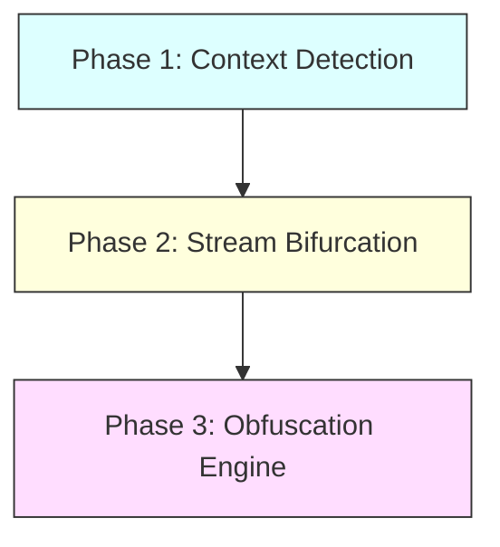

# CASOM: How the Protection Works

This document describes the operational flow and mechanism of the **Context-Aware Sensor Obfuscation Middleware (CASOM)**, illustrating how it defends against side-channel virtual keystroke attacks like SNOOPFINGER.

---

## 1. Operational Flow Overview

The protection operates as an OS-level service in the AR/VR platform, executing in three consecutive phases:



---

## 2. Phase 1: Context-Aware Detection

Obfuscating sensor data continuously would degrade user experience (UX) for regular activities such as playing games, painting, or using VR gestures that require millimeter-level precision.

To avoid this, CASOM is **context-aware**:
- It monitors system events (e.g., when the Virtual Keyboard focus goes high).
- It analyzes head motion stability. Typing requires focusing on keys, which creates a signature pattern of micro-pauses.
- Once these triggers are detected, the middleware activates its **obfuscation routine**.

---

## 3. Phase 2: Stream Bifurcation (Data Separation)

Once typing is detected, CASOM separates the sensor streams between apps based on their permissions and window focus state:

1. **Foreground Application (Virtual Keyboard)**:
   - Receives the **raw, clean, high-precision** sensor coordinate data.
   - **Result**: Legitimate typing actions are processed with 100% accuracy and zero latency.
   
2. **Background Applications (Potential Spyware)**:
   - Blocked from reading raw sensor registers.
   - Forced to receive the output of the **obfuscation engine**.
   - **Result**: Malicious background trackers cannot access the high-resolution movements required to map gaze to keys.

---

## 4. Phase 3: Obfuscation Engine

The SNOOPFINGER attack relies on **spatial-temporal clustering**. When a user types, their head pauses on key locations, creating dense clusters of gaze points. The attacker uses distance-based clustering algorithms to calculate the centroids of these clusters and matches them to standard keyboard coordinates.

CASOM destroys this threat mathematically by applying **obfuscation noise** to the background data stream:

### 4.1. The Mathematical Mechanism
For each coordinate coordinate pair $(x, y)$, CASOM calculates the protected output coordinates $(x', y')$:

$$x' = x + \text{Noise}_x$$
$$y' = y + \text{Noise}_y$$

By setting the noise scale parameter to $1.5$ cm (which is larger than the width of a virtual key), the points are scattered across multiple key boundaries.

---

## 5. Python Implementation Reference

In our codebase, this logic is implemented in [defender.py](file:///d:/CS%20IEEE/CSIEEE/defender.py) inside the `obfuscate_data` method:

```python
def obfuscate_data(self, gaze_points):
    """
    Intercepts raw gaze coordinates and injects noise 
    to scatter the clusters before they reach background apps.
    """
    obfuscated_points = []
    for (x, y) in gaze_points:
        if self.use_rounding:
            # Option A: Reduce precision by rounding coordinates
            ox = round(x)
            oy = round(y)
        else:
            # Option B: Add random noise to scatter points widely
            ox = x + random.uniform(-self.noise_scale, self.noise_scale)
            oy = y + random.uniform(-self.noise_scale, self.noise_scale)
        
        obfuscated_points.append((ox, oy))
        
    return obfuscated_points
```

---

## 6. How it Thwarts the Attacker

The diagram below shows how the raw clustered coordinates are scrambled, preventing the attacker from finding the true centroids:

```mermaid
grid-layout
    %% Conceptual representation of coordinate scattering
```

- **Unprotected**: Points form a tight cluster centered at `x = 2.0, y = 1.0` (Key: `F`). The centroid calculation points directly to `F`.
- **Protected by CASOM**: Points are dispersed across `x = [0.5, 3.5]` and `y = [-0.5, 2.5]`. The clustering algorithm calculates a false centroid pointing to `R` or `V` (resulting in gibberish character output like `'zrf'`).
