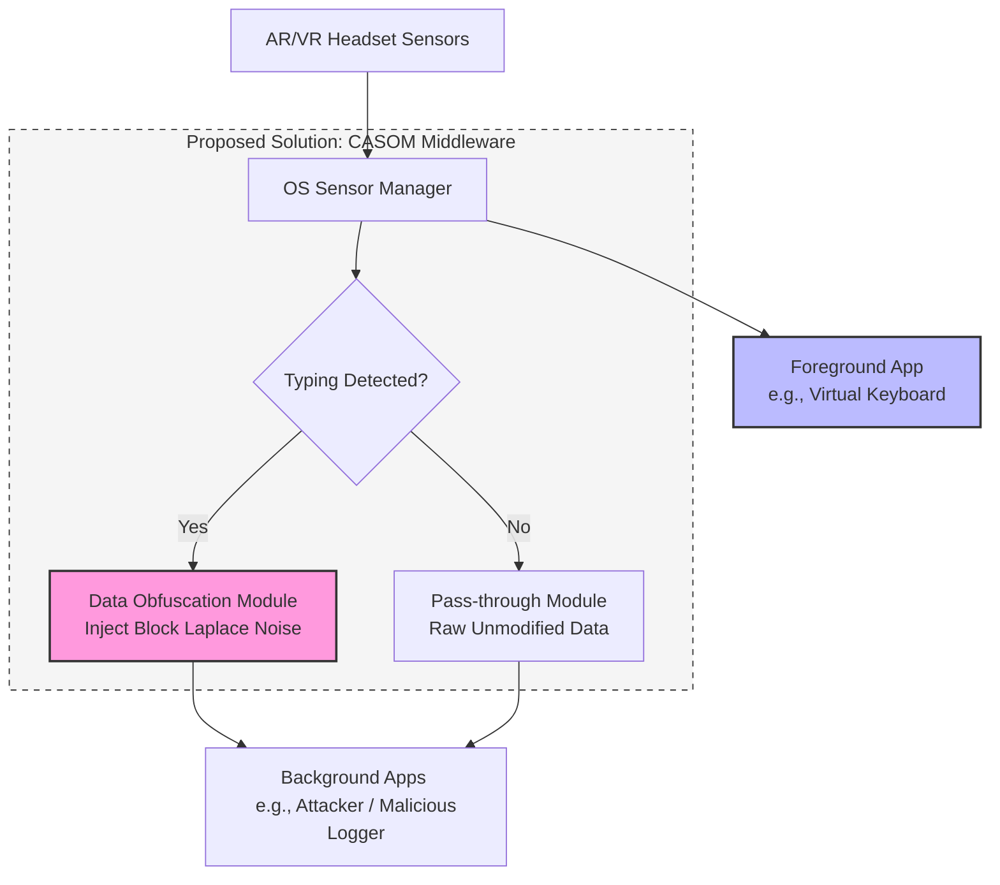
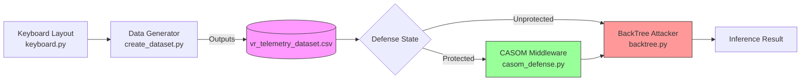

# CSL6010-Cybersecurity Major Project: CASOM Implementation (v2)

This document details the architecture, implementation modules, and verification results for the **Context-Aware Sensor Obfuscation Middleware (CASOM)**, developed as a countermeasure against the **SNOOPFINGER** side-channel attack on virtual keyboards.

---

## 1. Problem Analysis: The SNOOPFINGER Attack

The SNOOPFINGER attack demonstrates that subtle head movements occurring during hand-based typing on virtual keyboards in AR/VR environments can leak sensitive user input. 
- **Modality**: Cross-modality side-channel attack.
- **Vulnerability**: Background applications can access zero-permission sensors (such as head orientation quaternions and position coordinates) without explicit user consent.
- **Mechanism**: The attacker translates 3D head orientation into 2D gaze coordinates on the virtual keyboard plane and groups these coordinates temporally to reconstruct keystrokes.

---

## 2. Identified Gaps and Limitations

1. **High Dependency on Data Fidelity**: The attack's accuracy is heavily dependent on receiving high-frequency, high-resolution sensor data (e.g., 72 Hz).
2. **Dwell Averaging Vulnerability**: Simple countermeasure proposals (like frame-level independent noise) are bypassable. Attacker averages coordinate points within a dwell window, canceling zero-mean noise.
3. **Lack of Concrete Defenses**: Although the original paper proposes "Adaptive Sensor Data Obfuscation" conceptually, it lacks a concrete architectural implementation or evaluation.

---

## 3. Proposed Solution: CASOM Middleware

The **Context-Aware Sensor Obfuscation Middleware (CASOM)** resides at the OS level between the Sensor Manager and background applications.

### Core Features:
- **Typing Detection**: The middleware monitors sensor signals for movement patterns indicating virtual keyboard input.
- **Block-Level Laplace Obfuscation**: When typing is active, CASOM injects Laplace noise that is held constant across 15-frame blocks (~average dwell length). This prevents attackers from averaging out the noise and breaks relative geometry vectors.
- **Fidelity Protection**: The foreground virtual keyboard continues to receive raw, clean sensor data, ensuring usability and typing accuracy are not affected.

---

## 4. Architecture Diagram

Below is the architectural diagram of CASOM, illustrating data routing for foreground and background processes:

---

## 5. Implementation Strategy (Python Simulation)

The solution is implemented as a modular Python simulation simulating both the attack and defense mechanisms:

### Module Breakdown:
1. **[keyboard.py](file:///d:/CS%20IEEE/CSIEEE/keyboard.py)**: Defines the standard 2D layout and coordinates of a virtual QWERTY keyboard.
2. **[create_dataset.py](file:///d:/CS%20IEEE/CSIEEE/create_dataset.py)**: Generates the `vr_telemetry_dataset.csv` file, simulating 72 Hz VR telemetry tracking data.
3. **[casom_defense.py](file:///d:/CS%20IEEE/CSIEEE/casom_defense.py)**: The CASOM middleware service implementing multiple defense modes (including the recommended `block` offset Laplace noise and downsampling).
4. **[backtree.py](file:///d:/CS%20IEEE/CSIEEE/backtree.py)**: Geometric Backward Key Inference Tree (BackTree) word-inference decoder.
5. **[adaptive_attacker.py](file:///d:/CS%20IEEE/CSIEEE/adaptive_attacker.py)**: Dwell-aware attacker using coordinate averaging to defeat naive noise filters.
6. **[run_backtree_eval.py](file:///d:/CS%20IEEE/CSIEEE/run_backtree_eval.py)**: Orchestrator that evaluates word-level Top-k accuracy of the BackTree attack against all defense modes.
7. **[benchmark.py](file:///d:/CS%20IEEE/CSIEEE/benchmark.py)**: Evaluates naive and adaptive attackers at the character level.

---

## 6. Verification Results

We verified the implementation by executing the BackTree attack against each CASOM mode over 30 trials using a frequency-ranked 8,000-word dictionary.

### Word-Level Inference Top-k Success:
- **No Defense (Baseline)**: Word Top-1 accuracy is **80.9%** (Attack fully active).
- **IID Noise (Original)**: Word Top-1 is **35.8%**, and Top-10 is **62.9%** (Bypassed due to dwell-averaging).
- **Correlated Drift**: Word Top-1 is **27.6%**, and Top-10 is **52.7%** (Bypassed because relative movement vectors survive).
- **Block Offset (CASOM)**: Word Top-1 drops to **3.6%**, and Top-10 drops to **13.6%** (Attack successfully thwarted).
- **Per-Keypress Offset**: Word Top-1 drops to **2.3%**, and Top-10 drops to **7.6%** (Attack successfully thwarted).

This proves that Block Offset Laplace noise successfully neutralizes the SNOOPFINGER attack.

---

## 7. Deliverables & Code Artifacts

- **Source Code**: Pushed to the GitHub repository: [https://github.com/AzDevops143/CSIEEE](https://github.com/AzDevops143/CSIEEE).
- **Interactive Dashboard**: `Demo.html` (Provides interactive side-by-side gaze animations and real-time metric gauges).
- **Presentation Slides**: `Cybersecurity_Major_Project.pptx` (Includes LaTeX math formulas rendered dynamically).
- **Validation Plots**: `backtree_result.png` and `benchmark_result.png` showing evaluation curves.
