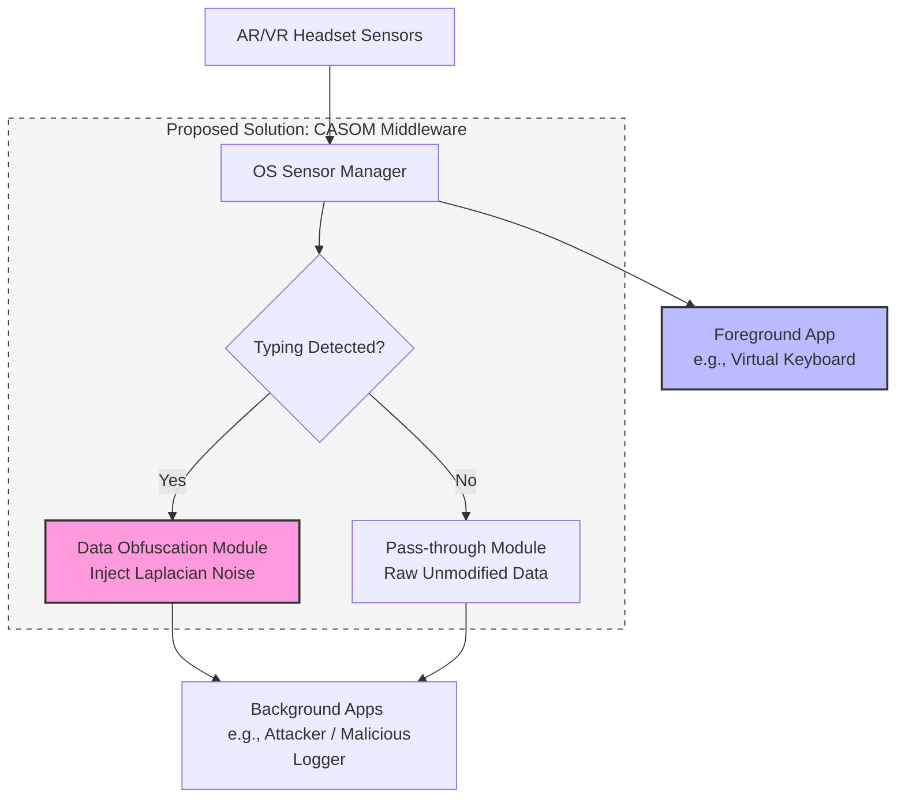
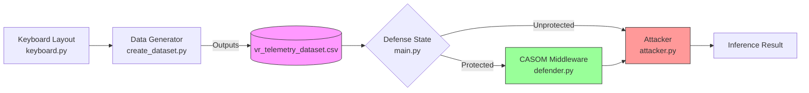

# CSL6010-Cybersecurity Major Project: CASOM Implementation

This document details the architecture, implementation modules, and verification results for the **Context-Aware Sensor Obfuscation Middleware (CASOM)**, developed as a countermeasure against the **SNOOPFINGER** side-channel attack on virtual keyboards.

---

## 1. Problem Analysis: The SNOOPFINGER Attack

The SNOOPFINGER attack demonstrates that subtle head movements occurring during hand-based typing on virtual keyboards in AR/VR environments can leak sensitive user input. 
- **Modality**: Cross-modality side-channel attack.
- **Vulnerability**: Background applications can access zero-permission sensors (such as head orientation quaternions and position coordinates) without explicit user consent.
- **Mechanism**: The attacker translates 3D head orientation into 2D gaze coordinates on the virtual keyboard plane and groups these coordinates temporally to reconstruct keystrokes.

---

## 2. Identified Gaps and Limitations

1. **High Dependency on Data Fidelity**: The attack's accuracy is heavily dependent on receiving high-frequency, high-resolution sensor data (e.g., 72 Hz).
2. **Conscious Suppression**: If a user is aware of the attack and consciously minimizes head movement, the attacker's inference rate drops significantly.
3. **Lack of Concrete Defenses**: Although the original paper proposes "Adaptive Sensor Data Obfuscation" conceptually, it lacks a concrete architectural implementation or verification.

---

## 3. Proposed Solution: CASOM Middleware

The **Context-Aware Sensor Obfuscation Middleware (CASOM)** resides at the OS level between the Sensor Manager and background applications.

### Core Features:
- **Typing Detection**: The middleware monitors sensor signals for movement patterns indicating virtual keyboard input.
- **Dynamic Obfuscation**: When active typing is detected, CASOM injects Laplacian noise into the head orientation data stream sent to background applications.
- **Fidelity Protection**: The foreground application (the virtual keyboard) continues to receive raw, clean sensor data, ensuring usability and typing accuracy are not affected.

---

## 4. Architecture Diagram

Below is the architectural diagram of CASOM, illustrating data routing for foreground and background processes:

---

## 5. Implementation Strategy (Python Simulation)

The solution is implemented as a modular Python simulation simulating both the attack and defense mechanisms:

### Module Breakdown:
1. **`keyboard.py`**: Defines the standard 2D layout and coordinates of a virtual QWERTY keyboard.
2. **`create_dataset.py`**: Generates the `vr_telemetry_dataset.csv` file, simulating 72 Hz VR telemetry tracking data.
3. **`attacker.py`**: Simulates SNOOPFINGER using a temporal distance clustering algorithm to infer keystrokes.
4. **`defender.py`**: Implements CASOM, injecting Laplacian noise ($\mu = 0, b = 1.5$) to obfuscate the data.
5. **`main.py`**: Orchestrates the simulation by reading the `.csv` dataset, running both protected and unprotected modes, and generating a side-by-side plot of results.

---

## 6. Verification Results

We verified the implementation by simulating typing the word `"foxenter"`.

### Case 1: Unprotected Scenario (Raw Data)
- The attacker receives raw, clean gaze points.
- **Result**: The clustering algorithm maps centroids accurately, resulting in the successfully inferred word: `'foxenter'` (100% accuracy).

### Case 2: Protected Scenario (CASOM Active)
- The defender injects Laplacian noise to scatter the gaze coordinates.
- **Result**: The attacker's clustering fails, resulting in a meaningless inference: `'zrf'` (Failed attack).

---

## 7. Deliverables & Code Artifacts

- **Source Code**: Pushed to the GitHub repository: [https://github.com/AzDevops143/CSIEEE](https://github.com/AzDevops143/CSIEEE).
- **Presentation Slides**: `Cybersecurity_Major_Project.pptx` (Includes LaTeX math formulas rendered dynamically).
- **Project Report**: `report.pdf` (Compiled via `pdflatex` from `report.tex`, containing detailed TikZ flowcharts and page footer reference links).
