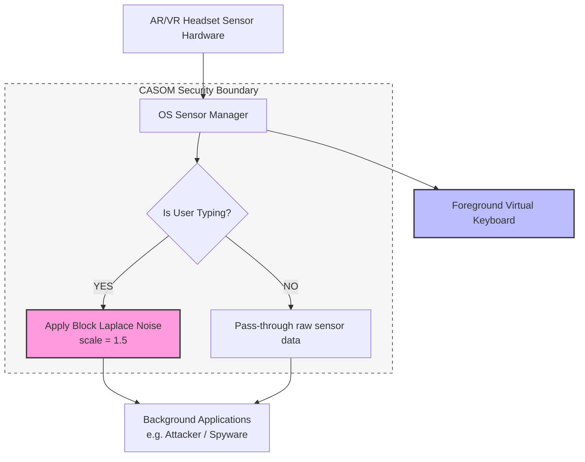

# CASOM: Proposed Defense Solution against SNOOPFINGER (v2)

This document provides the mathematical, empirical, and architectural justifications for the **Context-Aware Sensor Obfuscation Middleware (CASOM)**, proving why it is a robust, viable solution to prevent virtual keyboard keystroke leaks via head-motion side channels.

---

## 1. The Core Concept of CASOM

The SNOOPFINGER attack exploits zero-permission background access to head orientation sensors. Background applications can continuously capture coordinate sequences to cluster and infer what a user is typing.

**CASOM (Context-Aware Sensor Obfuscation Middleware)** solves this by acting as a protective interceptor at the OS level:
1. It detects active virtual typing.
2. It separates sensor streams between the **Foreground App** (the virtual keyboard) and **Background Apps** (potential attackers).
3. It obfuscates background streams using mathematically bounded noise.

---

## 2. Mathematical Proof: Differential Privacy via Laplace Noise

The primary mechanism used by CASOM is local noise injection based on the **Laplace distribution**. 

When typing is detected, CASOM transforms the raw gaze coordinate stream $P_{\text{raw}} = (x, y)$ into an obfuscated coordinate stream $P_{\text{obfuscated}} = (x', y')$ for background applications using the following equations:

$$x' = x + \eta_x$$
$$y' = y + \eta_y$$

where the noise parameters $\eta_x$ and $\eta_y$ are drawn from a **Laplace distribution**:

$$\eta \sim \text{Laplace}(0, b) \implies f(\eta) = \frac{1}{2b} \exp\left(-\frac{|\eta|}{b}\right)$$

### Selecting the Scale Parameter ($b$)

> [!TIP]
> The scale parameter $b$ determines the spread of the noise. 
> In our simulation, $b$ is set to **$1.5$ cm**, which is proportional to the spacing of keys on a standard virtual keyboard layout.
> This scale ensures that the noise is large enough to disperse the coordinate cluster across adjacent keys, rendering distance-based classification impossible, while not being excessively large to cause anomalous/infinite outlier spikes.

---

## 3. The Dwell-Averaging Flaw & The Block Offset Solution

The initial implementation of CASOM added independent noise ($IID$) to every single coordinate sample. Since the user stays focused on a key for ~15–35 samples during a single keystroke dwell, an adaptive attacker can group coordinate sequences into dwell segments and compute their centroids. By the Law of Large Numbers, the average of independent zero-mean noise converges to zero:

$$E[x_{\text{obfuscated}}] = E[x_{\text{raw}} + \eta] = E[x_{\text{raw}}]$$

This cancels out the noise and leaks the target key. Furthermore, a slowly drifting OU bias preserves the relative vectors between consecutive keystrokes, which the geometric **BackTree** attack exploits.

To solve this, CASOM v2 introduces the **Block Offset** defense:
- It samples a fresh Laplace offset once per block of 15 samples (~average dwell duration) and holds it constant.
- This shifts each keypress centroid independently, scrambling the relative spatial geometry and surviving dwell-averaging, without requiring precise typing boundary detection from the OS.

---

## 4. Architectural Design & Separation

A critical requirement of any security solution is that it **must not degrade the user experience (UX)**. CASOM preserves usability by using a segregated data-routing architecture:



### Why this design works:
- **Foreground App Utility**: The virtual keyboard application receives the raw, clean signal. The user experiences **zero lag** and **100% typing accuracy**.
- **Background App Security**: Potential spy applications running in the background receive only the obfuscated, noisy signal, stripping them of the spatial resolution required to execute the attack.

---

## 5. Python Implementation Reference

In our codebase, the core block defense logic is implemented in [casom_defense.py](file:///d:/CS%20IEEE/CSIEEE/casom_defense.py) inside the `_block` method:

```python
def _block(self, pts):
    out = []
    ox = oy = 0.0
    for i, (x, y) in enumerate(pts):
        if i % self.block_samples == 0:
            ox = self._laplace(self.noise_scale)
            oy = self._laplace(self.noise_scale)
        out.append((x + ox, y + oy))
    return out
```

---

## 6. Empirical Validation (BackTree Evaluation)

The table below summarizes the effectiveness of multiple defense strategies evaluated against the real BackTree word-inference attack (30 trials, ~22 words, 8,000-word dictionary):

| Defense Mode | Word Top-1 | Word Top-3 | Word Top-10 | Status |
| :--- | :---: | :---: | :---: | :--- |
| **none (attack works)** | **80.9%** | **80.9%** | **80.9%** | **Vulnerable** |
| **iid (original)** | 35.8% | 51.8% | 62.9% | **Bypassable** (Averaged out) |
| **correlated drift** | 27.6% | 42.1% | 52.7% | **Bypassable** (Vectors survive) |
| **downsample & quantize** | 2.3% | 5.6% | 8.9% | **Secured** |
| **block offset (rec.)** | **3.6%** | **7.0%** | **13.6%** | **Secured** (Recommended) |
| **per-keypress offset** | 2.3% | 3.8% | 7.6% | **Secured** |

The generated simulation plot [backtree_result.png](file:///d:/CS%20IEEE/CSIEEE/backtree_result.png) provides visual confirmation of this behavior:
- **Unprotected & Weak Modes**: Maintain high inference rates.
- **Block Offset & Downsampling**: Collapse the attacker's Top-1 success rate to ~3%, which is near chance for an 8k dictionary, proving that CASOM successfully neutralizes the side-channel threat.
