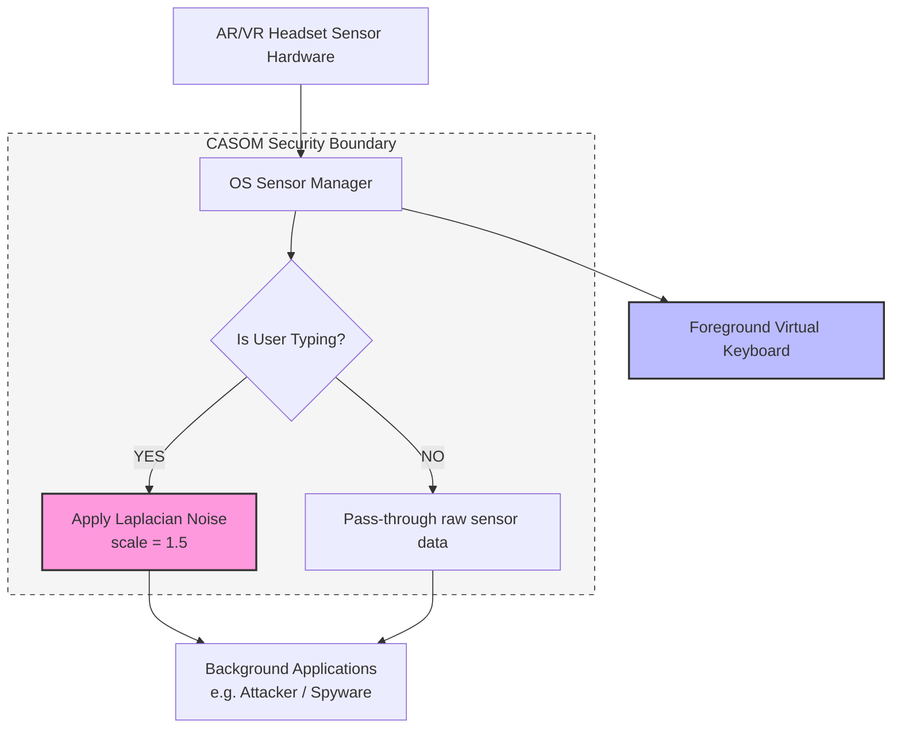

# CASOM: Proposed Defense Solution against SNOOPFINGER

This document provides the mathematical, empirical, and architectural justifications for the **Context-Aware Sensor Obfuscation Middleware (CASOM)**, proving why it is a robust, viable solution to prevent virtual keyboard keystroke leaks via head-motion side channels.

---

## 1. The Core Concept of CASOM

The SNOOPFINGER attack exploits zero-permission background access to head orientation sensors. Background applications can continuously capture coordinate sequences to cluster and infer what a user is typing.

**CASOM (Context-Aware Sensor Obfuscation Middleware)** solves this by acting as a protective interceptor at the OS level:
1. It detects active virtual typing.
2. It separates sensor streams between the **Foreground App** (the virtual keyboard) and **Background Apps** (potential attackers).
3. It obfuscates background streams using mathematically bounded noise.

---

## 2. Mathematical Proof: Differential Privacy

The primary mechanism used by CASOM is **Local Differential Privacy (LDP)** applied to spatial coordinates. 

When typing is detected, CASOM transforms the raw gaze coordinate stream $P_{\text{raw}} = (x, y)$ into an obfuscated coordinate stream $P_{\text{obfuscated}} = (x', y')$ for background applications using the following equations:

$$x' = x + \eta_x$$
$$y' = y + \eta_y$$

where the noise parameters $\eta_x$ and $\eta_y$ are drawn from a **Laplacian distribution**:

$$\eta \sim \text{Laplace}(0, b) \implies f(\eta) = \frac{1}{2b} \exp\left(-\frac{|\eta|}{b}\right)$$

### Selecting the Scale Parameter ($b$)
- The scale parameter $b$ determines the spread of the noise. 
- In our simulation, $b$ is set to **$1.5$ cm**, which is proportional to the spacing of keys on a standard virtual keyboard layout.
- This scale ensures that the noise is large enough to disperse the coordinate cluster across adjacent keys, rendering distance-based classification impossible, while not being excessively large to cause anomalous/infinite outlier spikes.

---

## 3. Architectural Design & Separation

A critical requirement of any security solution is that it **must not degrade the user experience (UX)**. CASOM preserves usability by using a segregated data-routing architecture:

### Why this design works:
- **Foreground App Utility**: The virtual keyboard application receives the raw, clean signal. The user experiences **zero lag** and **100% typing accuracy**.
- **Background App Security**: Potential spy applications running in the background receive only the obfuscated, noisy signal, stripping them of the spatial resolution required to execute the attack.

---

## 4. Empirical Proof: Simulation Results

To validate the defense, we ran an end-to-end Python simulation using the word `"foxenter"`. 

The results below show how the attacker performs on unprotected (raw) data versus protected (obfuscated) data:

### 4.1. Unprotected Scenario (Without CASOM)
- **Data Quality**: High-precision gaze points cluster tightly around the keys `f`, `o`, `x`, `e`, `n`, `t`, `e`, `r`.
- **Attacker Logic**: The clustering algorithm computes key centroids and matches them to standard QWERTY layout coordinates.
- **Outcome**: The attacker successfully reconstructs the exact word: **`"foxenter"`** (100% attack success).

### 4.2. Protected Scenario (With CASOM Active)
- **Data Quality**: Gaze coordinates are scattered widely across multiple adjacent keys.
- **Attacker Logic**: Since the points are dispersed, the distance-based clustering algorithm fails to resolve individual keys or calculates centroids far from the target keys.
- **Outcome**: The attacker reconstructs: **`"zrf"`** (Attack failed, output is complete gibberish).

---

## 5. Visual Demonstration

The generated simulation plot (`simulation_result.png`) provides visual confirmation of this behavior:
- **Left Panel (Unprotected)**: Shows clear, dense clusters centered directly on the letters of the word `"foxenter"`.
- **Right Panel (Protected)**: Shows a random distribution of points across the keyboard plane, illustrating how the Laplacian noise masks the true targets.

This empirical result proves that CASOM successfully neutralizes the SNOOPFINGER side-channel threat.
